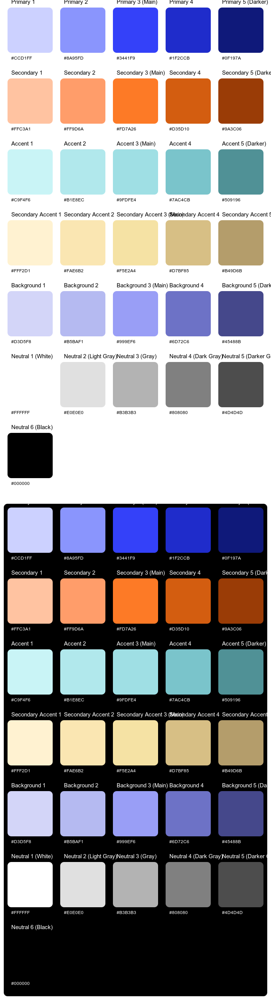

# **InkGrid**

  
  
  
  


---

## **What is InkGrid?**

**InkGrid** is a lightweight and flexible tool designed to automate the creation of **structured SVG swatches** from text-based color templates. The resulting SVG files are optimized for modern design systems, providing organized and reusable outputs for developers and designers alike.

> InkGrid also exports JSON-compatible color tokens for seamless integration with Figma via the [InkGrid Tokens Plugin](https://github.com/JonasZeihe/InkGrid-Tokens).

---

## **Features**

- **Automated SVG Swatches**: Create reusable color assets in seconds.
- **Light and Dark Theme Support**: Outputs are compatible with UI/UX design systems.
- **Dynamic Grouping**: Organize colors automatically based on your template.
- **Flexible Templates**: Define structured palettes in an intuitive format.
- **High-Quality Outputs**: Professional SVG files ready for direct integration.
- **Figma Integration**: Export JSON color tokens for use with the InkGrid Tokens Plugin.

---

## **Getting Started**

### **Installation**

1. Clone the repository:

   ```bash
   git clone https://github.com/jonaszeihe/inkgrid.git
   cd inkgrid
   ```

````

2. Install dependencies:

   ```bash
   pip install -r requirements.txt
   ```

3. Run InkGrid with your template:

   ```bash
   python src/main.py templates/sample_colors.txt
   ```

---

## **Template Format**

InkGrid uses a simple text-based template format for defining color palettes. This format ensures flexibility and allows for clear organization. Below is the exact structure of a sample template:

### **Example Template** (`templates/sample_colors.txt`):

```plaintext
##############################################
# Color Palette Template for InkGrid
#
# Define structured color palettes for automated SVG generation.
# Format: <Category> <Number>: <HexValue>
##############################################

Primary 1:
Primary 2:
Primary 3 (Main):
Primary 4:
Primary 5 (Darker):

Secondary 1:
Secondary 2:
Secondary 3 (Main):
Secondary 4:
Secondary 5 (Darker):

Accent 1:
Accent 2:
Accent 3 (Main):
Accent 4:
Accent 5 (Darker):

Background 1:
Background 2:
Background 3 (Main):
Background 4:
Background 5 (Darker):
```

### **How It Works**

- **Categories** (e.g., `Primary`, `Secondary`) define logical groupings.
- **Numbering** helps distinguish variations of a color within a category.
- **Optional Descriptions** (e.g., `Main`, `Darker`) provide further clarity.

You can leave fields empty to serve as placeholders or fill them with HEX color values.

---

## **Output**

InkGrid generates a single SVG file containing:

- **Dual Themes**: Organized sections for light and dark modes.
- **Grouped Swatches**: Clearly labeled categories based on your template.
- **Professional Formats**: SVG outputs ready for integration into any design system.
* **JSON Tokens**: Optional export of Figma-compatible JSON for use with the InkGrid Tokens plugin.

### **Example Output**

- Your File: `colors.svg`
- Structure:
  - Light theme colors.
  - Dark theme colors.
  - Grouped by categories and ordered as per the template.



---

## **For Developers**

## Local Development & Scripts

InkGrid includes a full local script environment for development and testing:

### Initialization

```bash
python scripts/logic/init_project.py
```

or use platform-specific launchers:

#### macOS:

```bash
./scripts/mac/init_project.command
```

#### Windows:

```bash
scripts\windows\init_project.bat
```

---

### **You can use the scripts and specific runners to run, build, update and test the application**

---

### Extract full codebase (merged output)

```bash
python scripts/logic/extract_codebase.py optional_suffix
```

---

## **Figma Plugin Integration**

To directly use exported JSON color tokens in your Figma projects, install the companion plugin:

🔌 **[InkGrid Tokens Plugin](https://github.com/JonasZeihe/InkGrid-Tokens)**
Convert your InkGrid palettes into native Figma color styles with a single click.

---

## **License**

InkGrid is licensed under the **MIT License**. See the [LICENSE](./LICENSE) file for full details.

---

## **About**

- **Author**: Jonas Zeihe
- **Contact**: JonasZeihe@gmail.com
- **GitHub**: [https://github.com/jonaszeihe/inkgrid](https://github.com/jonaszeihe/inkgrid)

---

## **Support the Project**

If you find **InkGrid** useful, consider giving it a ⭐ on GitHub. Contributions are also welcome—open an issue or submit a pull request to help improve the project.
````
